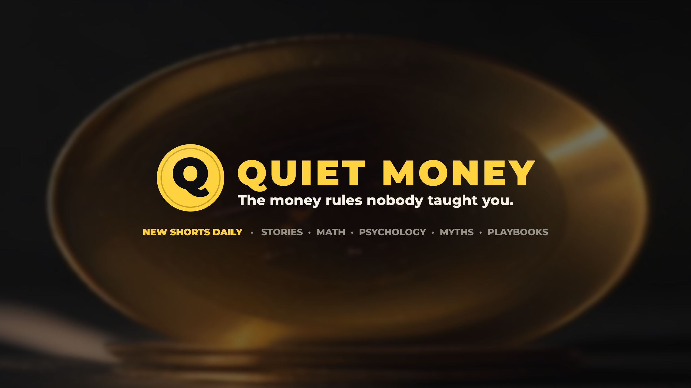

<p align="center"></p>

# Quiet Money

**The money rules nobody taught you, in 60 seconds, with real numbers.**

An autonomous faceless video studio for money psychology and personal finance. Every day it researches,
writes, voices, renders, quality-gates, and schedules five 61-72 second vertical videos for TikTok,
YouTube Shorts, and Instagram Reels, then publishes each one as a written page in the
[Money Rules Library](https://youngstunners88.github.io/quiet-money/).

- 📺 YouTube [@quietmoneyrules](https://www.youtube.com/@quietmoneyrules) · TikTok [@quietmoneyrules](https://www.tiktok.com/@quietmoneyrules) · Instagram [@quietmoneyrules](https://www.instagram.com/quietmoneyrules)
- 🌐 Website: https://youngstunners88.github.io/quiet-money/ (library, calculators, free 7-day Money Reset)
- 💸 Runs on free tiers: under $1/day

```
backlog topic → script (five-part prompt + computed money facts) → judge + 30 gates → voice (neural TTS, word timings)
  → images (FLUX.2) → render (Ken Burns, word-by-word captions, original music, -14 LUFS) → posting pack
  → TikTok / Shorts / Reels → library page + IndexNow → metrics + AI-visibility probes → tomorrow's mix
```

## Quick start
```bash
pip install --use-pep517 pysher && pip install -r requirements.txt   # + ffmpeg on PATH
export GEMINI_API_KEY=... CLOUDFLARE_API_KEY=... CLOUDFLARE_ACCOUNT_ID=...
python -m faceless doctor
python -m faceless make --pillar story     # one video
python -m faceless daily                   # the day's five (resumes; --extra N banks more ahead)
python -m faceless site build              # the website -> site/
python -m faceless aeo                     # are AI assistants recommending us?
python -m faceless brand                   # regenerate the brand kit
```

## Five series
| Series | Format |
|---|---|
| Money Stories | Real people, real outcomes (the janitor who left $8M) |
| The Math They Hide | One exact calculation (minimum payments take 21 years) |
| Money Psychology | A named bias and its counter-move (lifestyle creep) |
| Money Myths | A belief you hold, flipped with math (renting isn't throwing money away) |
| Do This Today | Three steps in 15 minutes (automate savings) |

## How quality is enforced
Every video runs the **gauntlet** (`faceless/gauntlet.py`): duration, hook, structure, originality, compliance
(no advice, no promised returns), an LLM editor/fact-check judge, a compression-based "AI slop" detector, render
specs, captions, loudness, and disclosures. Failures are rewritten automatically; anything still failing is held.
The round-by-round improvement log lives in `gauntlet/CONTEXT.md`.

## Automation
| Runner | When | What |
|---|---|---|
| Claude Code routine | daily | five videos, gauntlet, posting packs, commit state, send the videos to the owner |
| `site.yml` | every push to `main` | build the library, publish to `gh-pages`, ping IndexNow |
| `aeo.yml` | Mondays | answer-engine visibility probe → `analytics/aeo.jsonl` |
| `ci.yml` | every push | tests, imports, site build |
| `daily.yml` | manual only | optional GitHub-hosted batch (needs the keys as Actions secrets) |

## Where the keys live
No API key is stored in this repository or on GitHub. Pick one:
1. **Claude Code environment (default).** The keys are environment variables of the Claude Code cloud
   environment that runs the daily routine. `.claude/hooks/session-start.sh` installs dependencies.
2. **Your own computer.** Copy `.env.example` to `.env` (gitignored), fill it in, and run
   `python -m faceless daily`. The keys never leave the machine.
3. **GitHub Actions secrets (optional).** Only needed for `daily.yml`.

Required: `GEMINI_API_KEY` (or `OPENROUTER_API_KEY`), `CLOUDFLARE_API_KEY`, `CLOUDFLARE_ACCOUNT_ID`. Optional:
`OPENROUTER_API_KEY` (paid fallback), `COMPOSIO_API_KEY` (YouTube/TikTok connections), `UPLOAD_POST_API_KEY` +
`UPLOAD_POST_USER`, `ELEVENLABS_API_KEY`, `TYPESAFE_API_KEY`.

## Map
| Path | Role |
|---|---|
| `CLAUDE.md` | Studio identity + routing table for Claude Code (start here) |
| `studio.toml` | Brand, pillars, providers, budgets, schedule, site, AEO |
| `channel/` | Brand bible, profiles, monetization, compliance, SEO/AEO playbook, brand kit, free checklist |
| `script-lab/` | Topic backlog, drafts, final scripts |
| `faceless/` | The engine: pipeline, providers (LLM/TTS/images/publish/Composio), gauntlet, site, AEO, brand |
| `gauntlet/`, `analytics/`, `state/` | Reports, metrics, journal, ledger, decision records |
| `.claude/skills/` | Claude Code skills: daily, script, gauntlet, trends, publish, analytics, composio, channel-setup, seo, aeo, growth |

Educational content, not financial advice. Narration and visuals are AI-assisted and labeled on every platform.
